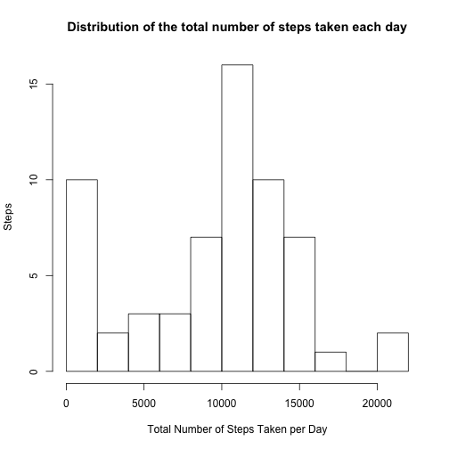
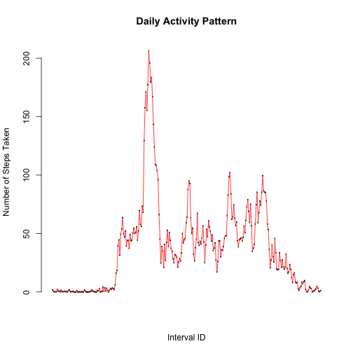
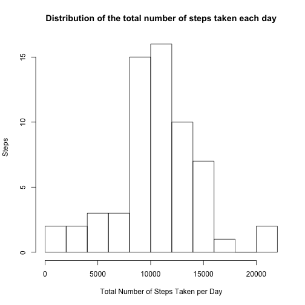
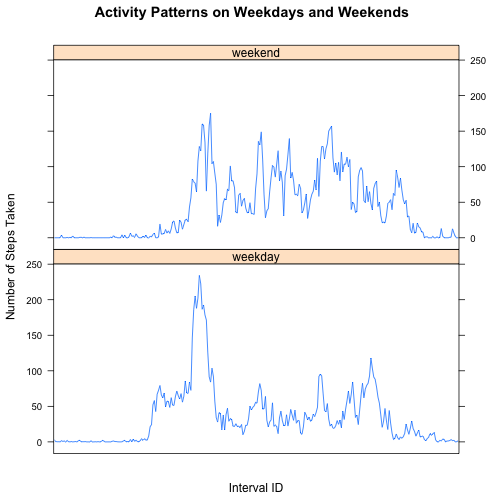

## Loading and preprocessing the data


```r
library(data.table)
```

```
## data.table 1.9.4  For help type: ?data.table
## *** NB: by=.EACHI is now explicit. See README to restore previous behaviour.
```

```r
library(dplyr)
```

```
## 
## Attaching package: 'dplyr'
## 
## The following objects are masked from 'package:data.table':
## 
##     between, last
## 
## The following object is masked from 'package:stats':
## 
##     filter
## 
## The following objects are masked from 'package:base':
## 
##     intersect, setdiff, setequal, union
```

```r
library(lattice)
```


```r
Data <- fread("activity.csv", 
              sep = "," , 
              na.strings = "NA", 
              header = T 
              
             )

Data ; str(Data); summary(Data)
```

```
##        steps       date interval
##     1:    NA 2012-10-01        0
##     2:    NA 2012-10-01        5
##     3:    NA 2012-10-01       10
##     4:    NA 2012-10-01       15
##     5:    NA 2012-10-01       20
##    ---                          
## 17564:    NA 2012-11-30     2335
## 17565:    NA 2012-11-30     2340
## 17566:    NA 2012-11-30     2345
## 17567:    NA 2012-11-30     2350
## 17568:    NA 2012-11-30     2355
```

```
## Classes 'data.table' and 'data.frame':	17568 obs. of  3 variables:
##  $ steps   : int  NA NA NA NA NA NA NA NA NA NA ...
##  $ date    : chr  "2012-10-01" "2012-10-01" "2012-10-01" "2012-10-01" ...
##  $ interval: int  0 5 10 15 20 25 30 35 40 45 ...
##  - attr(*, ".internal.selfref")=<externalptr>
```

```
##      steps            date              interval     
##  Min.   :  0.00   Length:17568       Min.   :   0.0  
##  1st Qu.:  0.00   Class :character   1st Qu.: 588.8  
##  Median :  0.00   Mode  :character   Median :1177.5  
##  Mean   : 37.38                      Mean   :1177.5  
##  3rd Qu.: 12.00                      3rd Qu.:1766.2  
##  Max.   :806.00                      Max.   :2355.0  
##  NA's   :2304
```

The data is a tidy data. The one (apparent) issue is the number of NA values for the step variable (This will be dealt with later on). 

For convenience we will coerce the "date" and "interval" identifier variables to factor variables  ( this can be undone if need be later on). In addition, we can rename the "interval" variable as "interval.ID".


```r
Data$date <- as.factor(Data$date)
Data$interval <- as.factor(Data$interval)
Data <- Data %>% rename(interval.ID = interval)
```


## What is mean total number of steps taken per day?

We can get the total number of steps taken per day like this:


```r
steps.per.day <- Data[, .(sum.of.steps = sum(steps, na.rm = T)), by = .(Date = date)]
steps.per.day
```

```
##           Date sum.of.steps
##  1: 2012-10-01            0
##  2: 2012-10-02          126
##  3: 2012-10-03        11352
##  4: 2012-10-04        12116
##  5: 2012-10-05        13294
##  6: 2012-10-06        15420
##  7: 2012-10-07        11015
##  8: 2012-10-08            0
##  9: 2012-10-09        12811
## 10: 2012-10-10         9900
## 11: 2012-10-11        10304
## 12: 2012-10-12        17382
## 13: 2012-10-13        12426
## 14: 2012-10-14        15098
## 15: 2012-10-15        10139
## 16: 2012-10-16        15084
## 17: 2012-10-17        13452
## 18: 2012-10-18        10056
## 19: 2012-10-19        11829
## 20: 2012-10-20        10395
## 21: 2012-10-21         8821
## 22: 2012-10-22        13460
## 23: 2012-10-23         8918
## 24: 2012-10-24         8355
## 25: 2012-10-25         2492
## 26: 2012-10-26         6778
## 27: 2012-10-27        10119
## 28: 2012-10-28        11458
## 29: 2012-10-29         5018
## 30: 2012-10-30         9819
## 31: 2012-10-31        15414
## 32: 2012-11-01            0
## 33: 2012-11-02        10600
## 34: 2012-11-03        10571
## 35: 2012-11-04            0
## 36: 2012-11-05        10439
## 37: 2012-11-06         8334
## 38: 2012-11-07        12883
## 39: 2012-11-08         3219
## 40: 2012-11-09            0
## 41: 2012-11-10            0
## 42: 2012-11-11        12608
## 43: 2012-11-12        10765
## 44: 2012-11-13         7336
## 45: 2012-11-14            0
## 46: 2012-11-15           41
## 47: 2012-11-16         5441
## 48: 2012-11-17        14339
## 49: 2012-11-18        15110
## 50: 2012-11-19         8841
## 51: 2012-11-20         4472
## 52: 2012-11-21        12787
## 53: 2012-11-22        20427
## 54: 2012-11-23        21194
## 55: 2012-11-24        14478
## 56: 2012-11-25        11834
## 57: 2012-11-26        11162
## 58: 2012-11-27        13646
## 59: 2012-11-28        10183
## 60: 2012-11-29         7047
## 61: 2012-11-30            0
##           Date sum.of.steps
```

Now, let's see the distribution of the total number of steps taken each day:


```r
steps.per.day[, hist(sum.of.steps, breaks = 10, main = "Distribution of the total number of steps taken each day", 
    xlab = "Total Number of Steps Taken per Day", ylab = " Steps")]
```

 

```
## $breaks
##  [1]     0  2000  4000  6000  8000 10000 12000 14000 16000 18000 20000
## [12] 22000
## 
## $counts
##  [1] 10  2  3  3  7 16 10  7  1  0  2
## 
## $density
##  [1] 8.196721e-05 1.639344e-05 2.459016e-05 2.459016e-05 5.737705e-05
##  [6] 1.311475e-04 8.196721e-05 5.737705e-05 8.196721e-06 0.000000e+00
## [11] 1.639344e-05
## 
## $mids
##  [1]  1000  3000  5000  7000  9000 11000 13000 15000 17000 19000 21000
## 
## $xname
## [1] "sum.of.steps"
## 
## $equidist
## [1] TRUE
## 
## attr(,"class")
## [1] "histogram"
```

And, finally, we get the mean and median of the total number of steps taken per day:


```r
report <- steps.per.day[, .(Mean = mean(sum.of.steps), Median = median(sum.of.steps))]
report
```

```
##       Mean Median
## 1: 9354.23  10395
```

## What is the average daily activity pattern?

First, (1) we can find the average number of steps taken for each 5-minute interval accross all the days. Then, (2) we plot the time series relating each 5-minute interval to its average number of steps taken (accross all days):


```r
xy.table <- Data[,
                  .(number.of.steps = mean(steps, na.rm =T)) , 
                  by = .(interval.ID = interval.ID)
                ]

xy.table
```

```
##      interval.ID number.of.steps
##   1:           0       1.7169811
##   2:           5       0.3396226
##   3:          10       0.1320755
##   4:          15       0.1509434
##   5:          20       0.0754717
##  ---                            
## 284:        2335       4.6981132
## 285:        2340       3.3018868
## 286:        2345       0.6415094
## 287:        2350       0.2264151
## 288:        2355       1.0754717
```

```r
with(xy.table, 
     
     plot(
          interval.ID,
          number.of.steps,
          xlab ="Interval ID",
          ylab ="Number of Steps Taken", 
          main ="Daily Activity Pattern",
          axes=FALSE
          )
     )


axis(side=2, at=seq(0, 225, by=50))
with(xy.table, lines(interval.ID, number.of.steps, type = "l", col = "red"))
```

 

*Note: The x-axis (and its 288 labels) is purposely made invisible for better viewing.*

Which 5-minute interval, on average across all the days in the dataset, contains the maximum number of steps?


```r
Data$interval.ID[with(xy.table, which.max(number.of.steps))]
```

```
## [1] 835
## 288 Levels: 0 5 10 15 20 25 30 35 40 45 50 55 100 105 110 115 120 ... 2355
```

So, the interval with ID:835 is the answer. Specifically this corresponds to the elapsed time between 8:30 am and 8:35 am.


## Imputing missing values

Calculating the total number of missing values in the dataset (i.e. the total number of rows with NAs):


```r
nrow(Data %>% filter(is.na(steps)))
```

```
## [1] 2304
```


A method of replacing the NA values is to, first, (1) find the average number of steps taken for each 5-minute interval accross all days. Then, (2) we calculate the median of those averages and use it to replace the NA values. 

 

```r
# (1) is already done and the results are saved in the xy.table object made
# in the previous section

# (2)
replacement.value <- xy.table %>% summarise(Median = median(number.of.steps))
replacement.value
```

```
##      Median
## 1: 34.11321
```

Now, let's see what we get:


```r
new.Data <- Data
new.Data$steps[with(new.Data, is.na(steps))] = trunc(replacement.value$Median)

steps.per.day <- new.Data %>% group_by(date) %>% summarise(sum.of.steps = sum(steps))
steps.per.day
```

```
## Source: local data table [61 x 2]
## 
##          date sum.of.steps
## 1  2012-10-01         9792
## 2  2012-10-02          126
## 3  2012-10-03        11352
## 4  2012-10-04        12116
## 5  2012-10-05        13294
## 6  2012-10-06        15420
## 7  2012-10-07        11015
## 8  2012-10-08         9792
## 9  2012-10-09        12811
## 10 2012-10-10         9900
## ..        ...          ...
```

the distribution of the total number of steps taken each day:


```r
steps.per.day[, hist(sum.of.steps, breaks = 10, main = "Distribution of the total number of steps taken each day", 
    xlab = "Total Number of Steps Taken per Day", ylab = " Steps")]
```

 

```
## $breaks
##  [1]     0  2000  4000  6000  8000 10000 12000 14000 16000 18000 20000
## [12] 22000
## 
## $counts
##  [1]  2  2  3  3 15 16 10  7  1  0  2
## 
## $density
##  [1] 1.639344e-05 1.639344e-05 2.459016e-05 2.459016e-05 1.229508e-04
##  [6] 1.311475e-04 8.196721e-05 5.737705e-05 8.196721e-06 0.000000e+00
## [11] 1.639344e-05
## 
## $mids
##  [1]  1000  3000  5000  7000  9000 11000 13000 15000 17000 19000 21000
## 
## $xname
## [1] "sum.of.steps"
## 
## $equidist
## [1] TRUE
## 
## attr(,"class")
## [1] "histogram"
```

And, finally, we get the mean and median of the total number of steps taken per day:


```r
report <- steps.per.day[, .(Mean = mean(sum.of.steps), Median = median(sum.of.steps))]
report
```

```
## Source: local data table [1 x 2]
## 
##       Mean Median
## 1 10638.43  10395
```

We do get a diferent value for the Mean after imputing the NA values. But this new value is not greatly different (in maginitude) from the Mean calculated without imputation. The Median stay the same. These two different data sets should not, in principle, give widely different results when used to perform the same analysis. 


## Are there differences in activity patterns between weekdays and weekends?


```r
#Creating the new factor variable is.Weekday
Data <- Data%>%mutate(
                      Days= as.factor(weekdays(as.Date(date, "%Y-%m-%d"))),
                      is.Weekday = !(as.character(Days) %in% c("Saturday","Sunday"))
                      )

# a dummy vector to contain either weekday or weekend.
dummy <- rep("weekday", nrow(Data));
dummy[Data$is.Weekday == FALSE] = "weekend"
# Converting is.Weekday's TRUE/FALSE values to weekday/weekend values
Data$is.Weekday <- as.factor(dummy)

Data
```

```
##        steps       date interval.ID   Days is.Weekday
##     1:    NA 2012-10-01           0 Monday    weekday
##     2:    NA 2012-10-01           5 Monday    weekday
##     3:    NA 2012-10-01          10 Monday    weekday
##     4:    NA 2012-10-01          15 Monday    weekday
##     5:    NA 2012-10-01          20 Monday    weekday
##    ---                                               
## 17564:    NA 2012-11-30        2335 Friday    weekday
## 17565:    NA 2012-11-30        2340 Friday    weekday
## 17566:    NA 2012-11-30        2345 Friday    weekday
## 17567:    NA 2012-11-30        2350 Friday    weekday
## 17568:    NA 2012-11-30        2355 Friday    weekday
```

```r
xy.table <- Data[,
                  .(number.of.steps = mean(steps, na.rm =T)) , 
                  by = .(interval.ID = interval.ID , is.Weekday = is.Weekday)
                ]

xy.table
```

```
##      interval.ID is.Weekday number.of.steps
##   1:           0    weekday       2.3333333
##   2:           5    weekday       0.4615385
##   3:          10    weekday       0.1794872
##   4:          15    weekday       0.2051282
##   5:          20    weekday       0.1025641
##  ---                                       
## 572:        2335    weekend      12.5714286
## 573:        2340    weekend       6.7142857
## 574:        2345    weekend       1.8571429
## 575:        2350    weekend       0.0000000
## 576:        2355    weekend       0.0000000
```

```r
xyplot(number.of.steps~interval.ID | is.Weekday, 
       data=xy.table,
       main="Activity Patterns on Weekdays and Weekends", 
       xlab="Interval ID",  
       ylab="Number of Steps Taken",
       layout=c(1,2),
       type=c("l","l"),
       scales = list(
                      #just to get rid of the interval ID cluster on the x-axis
                      x = list(at= levels(Data$interval.ID)[seq(1,288,47)]), 
                      # the y-axis labelling
                      y = list(at=seq(0, 250, 50))
                     )
       
       )
```

 

Based on this graphs, one can speculate that *this person is more active(on his/her feet) on weekends compared to weekdays (!)*. To support this claim, we can (1) find and compare the mean number of steps taken on weekdays and weekends respectively. (2) For each type of days (weekdays or weekends), we can compare the number of 5-minute intervals during which 100 or more steps are taken in average. The results from these two calculations should be enough to prove our claim.


```r
# (1)
Means <- xy.table[, .(Mean = mean(number.of.steps)), by = is.Weekday]
Means
```

```
##    is.Weekday     Mean
## 1:    weekday 35.33796
## 2:    weekend 43.07837
```

```r
# (2)
Above.100.steps.weekdays <- filter(xy.table, as.character(is.Weekday) == "weekday" & 
    number.of.steps > 100)
Above.100.steps.weekends <- filter(xy.table, as.character(is.Weekday) == "weekend" & 
    number.of.steps > 100)
Day.Type <- c("Weekday", "Weekend")
More.than.100.steps <- c(nrow(Above.100.steps.weekdays), nrow(Above.100.steps.weekends))

report <- data.frame(Day.Type, More.than.100.steps)
report
```

```
##   Day.Type More.than.100.steps
## 1  Weekday                  15
## 2  Weekend                  40
```

Results for (1) and (2) serve as evidence to support the fact that this person is more active on weekends.


---
